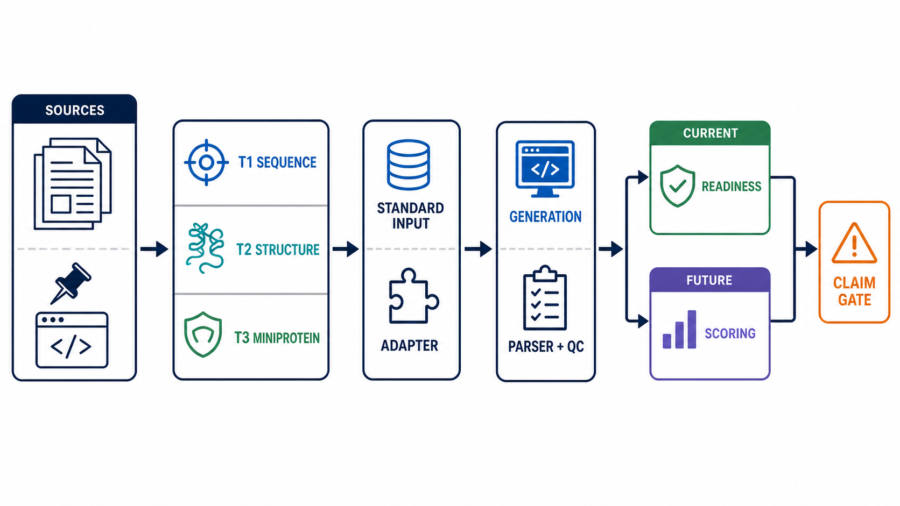
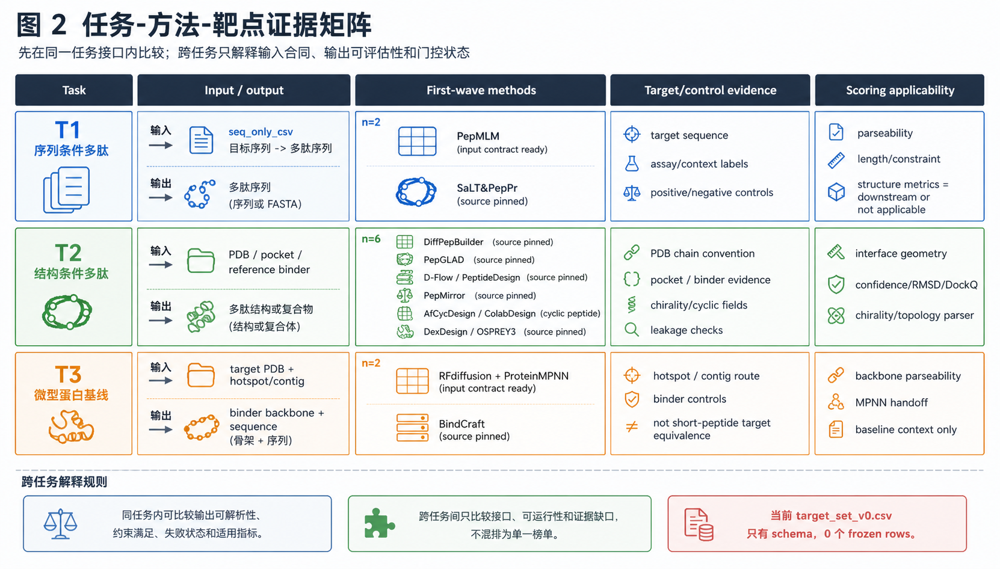
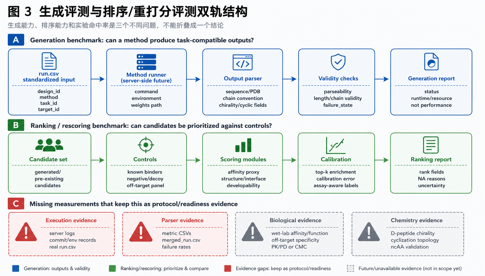
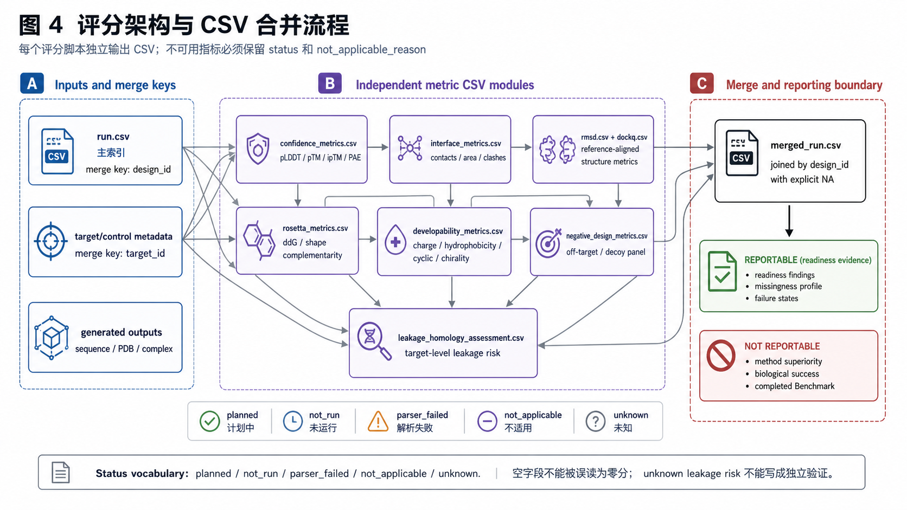

<p align="center">
  
</p>

<h1 align="center">Pep Design Benchmark KB</h1>

<p align="center">
  面向近期多肽设计方法的 protocol-first Benchmark 知识库
</p>

<p align="center">
  方法证据管理 · 输入输出契约 · 连通性审计 · 评价协议 · 稿件规划
</p>

> **当前结论（2026-07-25）**：知识库校验通过，但项目验收尚未通过。v0.35 唯一授权的 PepGLAD 执行在容器启动前因 Docker API socket 权限不足失败，未产生候选。当前材料不支持统一评分、方法排名、完整复现或生物学有效性结论。

## 项目定位

本仓库不是“最优多肽生成器”排行榜，也不是第三方模型或数据的镜像。它以可审计协议为中心，管理 10 类纳入方法的文献来源、代码固定点、任务归类、标准输入输出、执行门禁和证据边界。项目将“方法可找到”“接口可描述”“候选可解析”“可评分”“可比较”“获得实验验证”视为彼此独立的证据层。

当前科学计划为 [`updated_plan_v0.35.md`](ops/plans/updated_plan_v0.35.md)，Harness 工程计划为 [`harness_engineering_plan_v1.0.md`](ops/plans/harness_engineering_plan_v1.0.md)。机器可读约束以 [`project_acceptance_v1.json`](harness/contracts/project_acceptance_v1.json)、[`artifacts_v1.json`](harness/registry/artifacts_v1.json) 和 [`claims_v1.json`](harness/registry/claims_v1.json) 为准。

`render` 命令生成的本地读者视图为 `harness/PROJECT_ACCEPTANCE.md`；它属于 generated non-evidence，不作为 GitHub 主页的固定来源链接。

**English summary.** Pep Design Benchmark KB is a protocol-first knowledge base for recent peptide-design methods. It separates literature provenance, source pinning, input contracts, parser evidence, scoring readiness and biological validation so that progress at one layer is not mistaken for success at another. Ten included method routes are organized into sequence-conditioned peptide design, structure-conditioned peptide design and miniprotein-binder baselines, with chirality, cyclization and non-canonical residues treated as cross-cutting constraints. The current repository contains bounded connectivity evidence and explicit failure records, not a completed head-to-head benchmark. In particular, the authorized v0.35 PepGLAD attempt failed before container start because the execution environment could not access the Docker API. No candidate, score or ranking was produced. Large runtime assets remain external and gitignored.

## 当前证据状态

| 项目 | 当前状态 | 可支持的解释 |
|:---|:---|:---|
| 版本 | `1.2.21` | unsigned harness checkpoint；未准备 `1.2.22` |
| KB 校验 | `0 errors / 0 warnings` | 结构、表格、引用和边界规则通过现有 validator |
| `current_phase` 验收 | `not_accepted` | Critical gate `current.v035_bounded_connectivity` 仍为 `FAIL` |
| v0.34 bounded connectivity | 14 条 run rows；12 条 candidate/QC；6 个 seed42 主任务及其 6 个 seed43 扩展为 `supported` | 支持指定 fixture 上的入口、解析和基础 QC 状态 |
| v0.35 PepGLAD | `attempt_001` 在容器启动前失败；无 candidate bundle | 仅支持基础设施失败的事实 |
| 目标集 | [`target_set_v0.csv`](benchmark/input_sets/target_set_v0.csv) 仅含表头 | 尚无 frozen target set |
| 评分与排名 | `not_run` | 尚未开展统一评分或方法排名 |
| 生物学验证 | `not_available` | 无 wet-lab、亲和力、细胞功能或 PK/PD 结论 |

> [!CAUTION]
> v0.35 的失败是基础设施失败，不是 PepGLAD 方法失败。容器未启动，parser 与 QC 未运行，`raw/` 中没有 candidate。该记录不能用于判断 mixed L/D 连通性、PepGLAD 方法表现或 OpenMM 影响。`attempt_001` 不得覆盖或重试；任何新执行均需新的明确授权和更新后的 attempt 政策。详见 [`v035_pepglad_connectivity_audit.md`](ops/audits/v035_pepglad_connectivity_audit.md)。

### 快速导航

- [方法与论文来源表](benchmark/method_sources/method_homepage_source_map_v0.35.csv)
- [Benchmark 协议](benchmark/protocols/benchmark_protocol_v0.md)
- [标准 job manifest](benchmark/input_sets/pilot_benchmark_job_manifest_v0.34.csv)
- [v0.34 候选输出](benchmark/results/pilot_candidate_outputs_v0.34.csv)
- [v0.34 候选 QC](benchmark/results/pilot_candidate_qc_v0.34.csv)
- [评分协议](benchmark/scoring/scoring_protocol_v0.md)
- [v0.34 连通性审计](ops/audits/v034_bounded_connectivity_audit.md)
- [当前验收合同](harness/contracts/project_acceptance_v1.json)
- [当前科学计划](ops/plans/updated_plan_v0.35.md)

## 项目流程



图中将来源核验、T1/T2/T3 任务归类、标准输入、方法适配、候选解析与 QC、当前 readiness 和未来 scoring 分开。它是主页导航图，不是运行结果或性能证据。生成记录与边界检查见 [`readme_imagegen_record_v1.md`](docs/assets/readme/readme_imagegen_record_v1.md)。

## 方法分类与来源

### 分类原则

| 任务 | 主要输入 | 预期输出 | 比较边界 |
|:---|:---|:---|:---|
| `T1_sequence_binder` | 靶蛋白序列、长度或界面上下文 | 候选肽序列 | 只与序列条件生成任务比较 |
| `T2_structure_peptide_binder` | 靶结构、链、口袋或参考配体约束 | 多肽序列及/或复合物结构 | 需区分 L、D、mixed、linear 与 cyclic |
| `T3_miniprotein_binder_baseline` | 靶结构、hotspot、binder 长度 | miniprotein backbone 与序列 | 作为邻近任务基线，不与短肽直接合并排名 |

手性、环化和非标准残基是跨任务约束，不构成第四个任务。不同拓扑、长度和输出模态不能用单一总分掩盖。

### T1：序列条件多肽设计

| 方法 | 输入 → 输出 | 代码与固定点 | 论文来源 | 当前项目证据 |
|:---|:---|:---|:---|:---|
| **PepMLM** | 靶序列、长度 → 多肽序列 | [repo](https://github.com/programmablebio/pepmlm) · [3169c49](https://github.com/programmablebio/pepmlm/commit/3169c4920f8c383948e0a5d3a7c8f87e5e7d2436) | [Nature Biotechnology, 2025](https://www.nature.com/articles/s41587-025-02761-2) | v0.34 两个 seed 均为 `WWX`；连通性 `supported`，保留非标准残基警告 |
| **SaLT&PepPr** | 靶序列与界面上下文 → guide-peptide 序列 | [repo](https://github.com/programmablebio/saltnpeppr) · [fba9d02](https://github.com/programmablebio/saltnpeppr/commit/fba9d029f34638fe87277f69b5d6a5797273c5a5) | [Communications Biology, 2023](https://www.nature.com/articles/s42003-023-05464-z) | 已记录来源与接口；不在 v0.34 pilot，既有 license gate 未关闭 |

### T2：结构条件多肽设计

| 方法 | 输入 → 输出 | 代码与固定点 | 论文来源 | 当前项目证据 |
|:---|:---|:---|:---|:---|
| **DiffPepBuilder** | 靶 PDB、位点 → L-peptide 序列与结构 | [repo](https://github.com/YuzheWangPKU/DiffPepBuilder) · [c19eb4f](https://github.com/YuzheWangPKU/DiffPepBuilder/commit/c19eb4f0cd2419d3bcc116184c0868243b6c4169) | [JCIM, 2024](https://pubs.acs.org/doi/10.1021/acs.jcim.4c00975) | v0.34 两个 fixture job 的候选解析与基础 QC 为 `supported` |
| **PepGLAD** | 靶 PDB、口袋 → full-atom 多肽序列与结构 | [repo](https://github.com/THUNLP-MT/PepGLAD) · [bad015c](https://github.com/THUNLP-MT/PepGLAD/commit/bad015ca50c312a89482adb5220c3d907f13df5c) | [NeurIPS, 2024](https://proceedings.neurips.cc/paper_files/paper/2024/hash/88ad9774ffcb7a272457e9396f793a07-Abstract-Conference.html) | v0.34 replay mismatch；v0.35 容器前基础设施失败；无当前候选 |
| **D-Flow / PeptideDesign** | 靶或镜像靶结构 → D-peptide 序列与结构 | [repo](https://github.com/smiles724/PeptideDesign) · [3e3e9f5](https://github.com/smiles724/PeptideDesign/commit/3e3e9f501ee16db318e9bf52643513636a07699a) | [arXiv:2411.10618](https://arxiv.org/abs/2411.10618) | v0.34 `supported`；3EQS fixture 有已知训练重叠，仅用于连通性 |
| **PepMirror** | 靶结构、手性上下文 → heterochiral 复合物与序列 | [repo](https://github.com/YZY010418/PepMirror) · [41cb31f](https://github.com/YZY010418/PepMirror/commit/41cb31f3974d91e1a2ca88f0db060405833e4a9c) | [arXiv:2602.20176](https://arxiv.org/abs/2602.20176) | v0.34 两个 D-peptide fixture job 为 `supported` |
| **AfCycDesign / ColabDesign cyclic peptide** | 靶结构、cyclic offset → 环肽序列与结构 | [repo](https://github.com/sokrypton/ColabDesign) · [e31a56f](https://github.com/sokrypton/ColabDesign/commit/e31a56fe1d9b4de25c8697f3a28b75892941cc72) | [Nature Communications, 2025](https://www.nature.com/articles/s41467-025-59940-7) | v0.34 两个 7ZKR cyclic fixture job 为 `supported` |
| **DexDesign / OSPREY3** | 靶结构、能量搜索约束 → D-peptide inhibitor 序列与结构 | [repo](https://github.com/donaldlab/OSPREY3) · [3d53244](https://github.com/donaldlab/OSPREY3/commit/3d53244851f0388db9e01b288bbd330145935aa7) | [Protein Engineering, Design and Selection, 2024](https://academic.oup.com/peds/article/doi/10.1093/protein/gzae007/7670946) | v0.29 仅有 synthetic input-contract fixture；不构成生成证据 |

### T3：miniprotein binder 邻近基线

| 方法 | 输入 → 输出 | 代码与固定点 | 论文来源 | 当前项目证据 |
|:---|:---|:---|:---|:---|
| **RFdiffusion + ProteinMPNN** | 靶 PDB、hotspot、长度 → backbone 与序列 | [RFdiffusion](https://github.com/RosettaCommons/RFdiffusion) · [2d0c003](https://github.com/RosettaCommons/RFdiffusion/commit/2d0c003df46b9db41d119321f15403dec3716cd9)；[ProteinMPNN](https://github.com/dauparas/ProteinMPNN) · [8907e66](https://github.com/dauparas/ProteinMPNN/commit/8907e6671bfbfc92303b5f79c4b5e6ce47cdef57) | [Nature, 2023](https://www.nature.com/articles/s41586-023-06415-8)；[Science, 2022](https://www.science.org/doi/10.1126/science.add2187) | v0.34 `supported`；当前为未线程化 all-Gly backbone 与独立 FASTA handoff |
| **BindCraft** | 靶 PDB、hotspot、长度范围 → backbone 与序列 | [repo](https://github.com/martinpacesa/BindCraft) · [b971db4](https://github.com/martinpacesa/BindCraft/commit/b971db42ba6e091afab63ccb30ae02215150a990) | [Nature, 2025](https://www.nature.com/articles/s41586-025-09429-6) | v0.29 仅有 external accepted-final parser fixture；不构成受控 Benchmark 结果 |

上述外链于 2026-07-25 核对。机器可读来源、完整提交 SHA、论文题名、persistent ID 和统一边界见 [`method_homepage_source_map_v0.35.csv`](benchmark/method_sources/method_homepage_source_map_v0.35.csv)。该表的证据边界固定为 `source_and_interface_navigation_only_not_runnability_or_performance`。



该矩阵用于解释任务覆盖、方法门禁和空目标集边界。它不表示方法优劣。

## 标准输入与输出

方法先接收统一 job 描述，再由 adapter 转换为 method-specific 输入。原始输出必须先进入 parser 和 QC，不能直接写入评分表。

| 层 | 必要字段或对象 | 规则 |
|:---|:---|:---|
| Job 身份 | `job_id`, `method`, `task_id`, `target_id`, `random_seed`, `attempt_id` | ID 不复用；失败 attempt 不覆盖 |
| 序列输入 | `target_sequence`, `length_min`, `length_max` | 适用于 T1 或 hybrid；缺失时 fail closed |
| 结构输入 | `target_pdb`, `target_chains`, `binder_chain`, `pocket_definition` | PDB 路径、链和 hash 必须可审计 |
| 化学与拓扑 | `peptide_type`, `chirality`, `cyclic`, `noncanonical_policy` | L、D、mixed、cyclic、ncAA 分别记录 |
| 方法原始输出 | external `raw_output_root`, command, environment, source/model pin, runtime, exit code | 大文件、日志、权重和结构留在外部或 gitignored root |
| 标准候选 | `design_id`, sequence, structure path, parse status, source output ID | 每个候选一行；与 job 和原始输出可追溯连接 |
| 基础 QC | 长度、链、手性、环化、非标准残基、文件 hash、handoff | `supported` 仅表示约定检查通过 |
| 评分输出 | metric-family CSV，统一以 `design_id` 合并 | 当前尚未运行；不得用空值补 0 |

完整接口见 [`job_manifest_schema_v0.11.md`](benchmark/protocols/job_manifest_schema_v0.11.md)、[`adapter_output_schema_v0.11.md`](benchmark/protocols/adapter_output_schema_v0.11.md)、[`run_csv_schema.md`](benchmark/protocols/run_csv_schema.md) 和 [`scoring_outputs_schema.md`](benchmark/protocols/scoring_outputs_schema.md)。

### 失败状态

状态值需要保留失败发生的位置。常用值包括 `planned`、`not_run`、`execution_failed`、`parse_failed`、`not_applicable` 和 `unknown`。没有候选时，不创建伪候选；没有可评估结构时，不把结构指标写为 0。

## 代表性测试数据

以下为 v0.34 seed42 的紧凑展示。它们是受限连通性 fixture，不是冻结测试集或性能样本。完整 14 条运行记录见 [`pilot_run_v0.34.csv`](benchmark/results/pilot_run_v0.34.csv)。

| 方法 | fixture / 任务 | 代表性输出 | 基础状态 | 解释限制 |
|:---|:---|:---|:---|:---|
| PepMLM | `pepmlm_sequence_contract_fixture` / T1 | `WWX`，3 aa | `passed` | 含非标准残基 `X` 警告 |
| DiffPepBuilder | `3EQS` / T2 | `PPPTGPFPPYW`，11 aa | `passed` | 仅解析、长度、链与基础 QC |
| PepGLAD | `3EQS` / T2 | 无候选 | `parse_failed` | v0.34 replay mismatch；seed43 未运行 |
| D-Flow | `3EQS` / T2 | `RIKKKKRKKRR`，11 aa，D | `passed` | 训练重叠使其不具备公平评分资格 |
| PepMirror | `3EQS` / T2 | `SLRAELRKMGP`，11 aa，D | `passed` | 仅镜像 round-trip 与基础手性检查 |
| AfCycDesign | `7ZKR` / T2 | `WDRKFVVENINITF`，14 aa，cyclic | `passed` | 检查 cyclic offset 与 terminal bond |
| RFdiffusion + ProteinMPNN | `7ZKR` / T3 | 90 aa FASTA | `passed` | 未线程化 backbone 与序列分离，非 sequence-resolved structure |

数据路径：

- 输入 job：[`pilot_benchmark_job_manifest_v0.34.csv`](benchmark/input_sets/pilot_benchmark_job_manifest_v0.34.csv)
- 执行摘要：[`pilot_execution_results_v0.34.csv`](benchmark/deployment/pilot_execution_results_v0.34.csv)
- 候选序列与结构索引：[`pilot_candidate_outputs_v0.34.csv`](benchmark/results/pilot_candidate_outputs_v0.34.csv)
- 基础 QC：[`pilot_candidate_qc_v0.34.csv`](benchmark/results/pilot_candidate_qc_v0.34.csv)
- runtime provenance：[`pilot_runtime_provenance_v0.34.json`](benchmark/results/pilot_runtime_provenance_v0.34.json)
- PepGLAD failure-only 记录：[`pilot_failure_diagnostics_v0.34.json`](benchmark/results/pilot_failure_diagnostics_v0.34.json)

PepGLAD v0.34 `attempt_003` 虽以进程退出码 0 结束，但 parser 返回 `pepglad_seed42_replay_mismatch`，merge 返回 `evidence_incomplete`。诊断中的 `AWHITLLIFTH` 不是候选，也未进入 12 条 candidate provenance。OpenMM 前后的手性变化提示该 attempt 中 mixed chirality 可观察，但不证明模型是根因，也不排除 OpenMM 影响。v0.35 随后的唯一授权 attempt 又在容器启动前失败，因此没有 v0.35 connectivity bundle。

## 评价标准

评价采用分层指标，而不是先设单一总分。生成能力和 ranking/rescoring 能力分别报告；实验结果不能由计算代理指标替代。

| 指标族 | 计划指标 | 适用对象 | 当前状态与限制 |
|:---|:---|:---|:---|
| `structure_confidence` | pLDDT、pTM、ipTM、PAE/iPAE、ipSAE | 预测结构与复合物 | `not_run`；需外部结构预测环境 |
| `interface_geometry` | contacts、interface area、H-bonds、clash count | 复合物结构 | `not_run`；sequence-only 输出为 `not_applicable` |
| `structure_similarity` | DockQ、backbone RMSD、interface RMSD | 有参考结构的任务 | `not_run`；需合法 reference |
| `design_feasibility` | 长度、链、手性、环化、parseability | 全部方法 | 当前仅有部分 fixture-level 基础 QC |
| `developability` | 分子量、净电荷、疏水性、芳香性、Cys、聚集与合成复杂度代理 | 多肽输出 | 仅允许 metadata-level proxy |
| `negative_design` | off-target panel、cross-reactivity、expected nonbinder | binder 任务 | `not_run`；controls 尚未冻结 |
| `leakage_homology` | 序列/结构聚类、motif overlap、training leakage risk | 全部目标 | 尚未闭环；D-Flow 3EQS 已标记 overlap |
| 实验验证 | affinity、结构、稳定性、细胞功能、PK/PD、CMC | 最终候选 | `not_available`；仍需验证 |



评分定义见 [`scoring_protocol_v0.md`](benchmark/scoring/scoring_protocol_v0.md)。所有 metric CSV 以 `design_id` 连接，最终才可合并至 `merged_run.csv`。缺失、不可适用和失败必须分别编码，不允许以 0 代替。

<details>
<summary>查看评分架构图</summary>



</details>

## 复核与复现边界

### 只读检查

```bash
python scripts/run_project_acceptance.py check --profile current_phase
PYTHONUTF8=1 python scripts/validate_benchmark_kb.py --no-write-report
pytest -q
git diff --check
```

在当前 v0.35 状态下，第一条命令预期返回非零退出码，因为 `current.v035_bounded_connectivity` 是未关闭的 Critical gate。这是项目事实，不应通过删改失败证据“修复”。validator 应以 `0 errors / 0 warnings` 结束。

### Readiness 顺序

```text
metadata_ready
  → source_pinned
  → license_checked
  → weights_manifested
  → input_contract_ready
  → dry_run_ready
  → smoke_test_ready
```

前一层通过不自动授予后一层状态。规划表、fixture、parser row 和 bounded example 均不能单独证明 `smoke_test_ready`、`benchmark_ready` 或完整复现。

### 仓库结构

```text
benchmark/          协议、输入、部署接口、紧凑结果与评分定义
harness/            验收合同、artifact/claim registry 与签核规则
kb/                 结构化参考文献、表格和方法知识页
manuscript/         Benchmark 稿件结构、证据表和规划图
ops/                当前计划、审计、验证报告与日志
scripts/            只读验收、校验、adapter/runner/parser 工具
sources/            只读来源快照与来源索引
tests/              协议、parser、validator 与 Harness 回归测试
docs/assets/readme/  主页图标、流程图和 ImageGen 生成记录
```

### 来源、许可与外部资产

- 本项目不修改 EndNote、Zotero 或上游 PD-wiki；`sources/raw_snapshots/` 只读。
- 第三方源代码、数据集、模型权重、Docker layers、原始日志和批量结构不进入 tracked KB。
- 代码固定点用于来源和接口复核，不代表依赖已安装、方法可运行或结果已复现。
- 各方法的软件与数据许可由其上游仓库和发布页决定。本仓库当前没有项目级 `LICENSE`，因此不得推定第三方内容可被重新分发。
- 新的 clone、install、large download、GPU generation、scoring 或 ranking 阶段均需明确授权。

## 维护入口

- 项目版本：[`VERSION`](VERSION)
- 主页索引：[`index.md`](index.md)
- 发布说明：[`RELEASE_NOTES.md`](RELEASE_NOTES.md)
- 方法来源目录：[`benchmark/method_sources/README.md`](benchmark/method_sources/README.md)
- Benchmark 目录：[`benchmark/README.md`](benchmark/README.md)
- 验收与对话签核：[`harness/signoffs/README.md`](harness/signoffs/README.md)
- 当前验证报告：[`wiki_validation_report.md`](ops/validation/wiki_validation_report.md)
- 变更日志：[`ops/log.md`](ops/log.md)

本主页以证据可追溯和边界可复核为首要原则。任何性能、优越性、复现性或生物学有效性结论，都必须由相应的合同要求和完整证据链支持。
