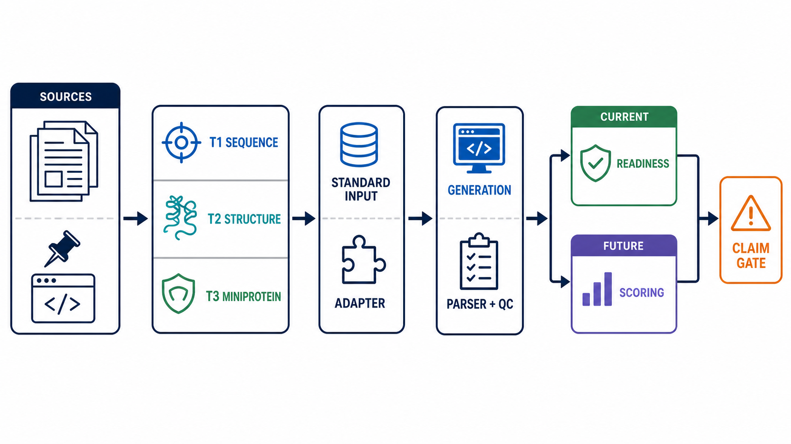
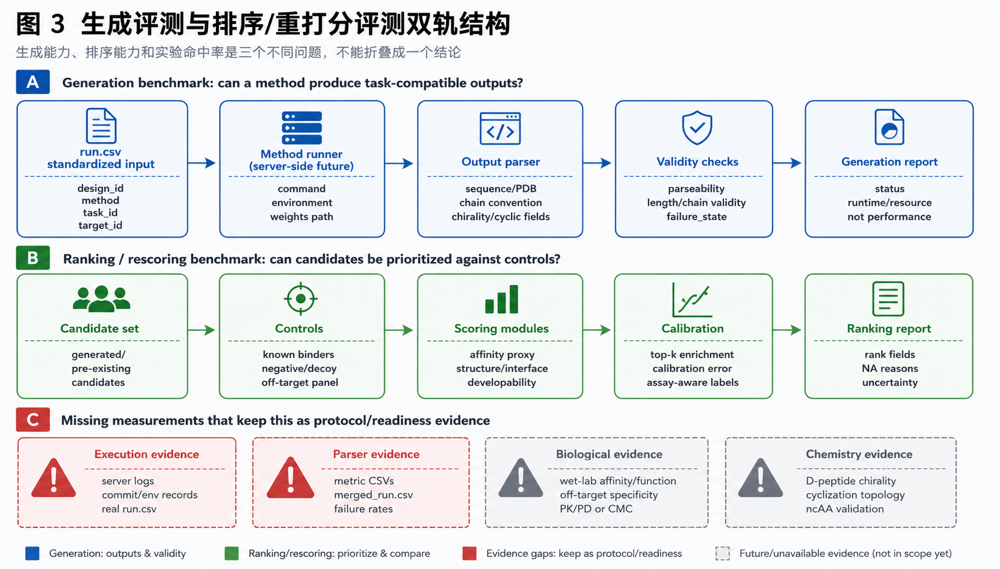

<p align="center">
  
</p>

<h1 align="center">Pep Design Benchmark KB</h1>

<p align="center">多肽设计方法的文献、代码环境验收与 Benchmark 准备</p>

<p align="center">
  <a href="#当前证据状态">当前状态</a> ·
  <a href="#方法分类与来源">10 种方法</a> ·
  <a href="#只读检查">本机复核</a> ·
  <a href="index.md">文档目录</a>
</p>

## 项目定位

Pep Design Benchmark KB 汇总多肽设计方法的论文、代码来源与运行证据，记录各方法的环境配置和原生任务验收，为后续可比较的 Benchmark 做准备。

目前已在现有本机环境完成 **10 种方法的小规模端到端运行**。每种方法按自身输入和输出要求验收，保留代码与权重来源、执行配置、日志索引和产物检查。当前重点是跑通代码与环境；统一目标、对照、评分和大规模比较留待下一阶段。

| 你要做的事 | 从这里开始 |
|:---|:---|
| 了解方法用途、输入输出和论文 | [方法总览](#方法分类与来源) · [方法知识页](kb/wiki/methods/_index.md) |
| 确认哪些任务跑通、哪些产物存在问题 | [运行验收报告](ops/acceptance/method_runtime_acceptance_v1.md) · [10 方法矩阵](benchmark/results/method_acceptance_matrix_v1.csv) |
| 在现有机器复核执行证据 | [只读检查](#只读检查) · [逐项报告 JSON](ops/acceptance/method_runtime_acceptance_v1.json) |
| 准备后续可比较实验 | [当前计划](ops/plans/method_runtime_acceptance_plan_v1.md) · [Benchmark 协议](benchmark/protocols/benchmark_protocol_v0.md) |

## 当前证据状态

截至 **2026-10-02**，项目版本为 [`1.2.21`](VERSION)。下列通过数均按**方法**统计，不代表候选成功率。

| 检查层 | 状态 | 解释 |
|:---|:---|:---|
| 代码与环境运行验收 | **10/10 方法通过** | 有边界的真实原生任务完成，来源和输出可重放核查 |
| 候选完整性质量检查 | **9/10 方法通过** | 使用各方法适用的序列、结构和原生过滤检查；D-Flow 未通过 |
| 当前阶段机器门禁 | 全部通过 | 项目总状态为 `pending_human_signoff`，正式签核尚未完成 |
| KB 校验 | `0 errors / 0 warnings` | 文档、表格、引用路径和既有边界检查通过 |
| 统一评分与方法比较 | `not_run` | 尚未开展统一评分或方法排名；目标和对照尚未冻结 |
| 生物学验证 | `not_available` | 尚无本项目的实验有效性结论 |

运行通过表示当前配置下的原生任务完成。质量检查单列，保留失败记录。不同方法使用了不同输入与产物终点，因此本轮结果不能用于比较性能、推断亲和力或声称全论文复现。


```mermaid
flowchart LR
    A["论文与代码来源"] --> B["固定环境、权重与输入"]
    B --> C["小规模原生任务"]
    C --> D["运行验收：10/10 方法"]
    C --> E["候选完整性：9/10 方法"]
    D -. "后续单独规划" .-> F["目标、对照与泄漏审查"]
    F -.-> G["统一评分与大量比较"]
    classDef done fill:#e8f3ed,stroke:#39745a,color:#193b2c;
    classDef recorded fill:#fff3dd,stroke:#997322,color:#59410e;
    classDef future fill:#eef1f5,stroke:#7a8594,color:#354052;
    class A,B,C,D done;
    class E recorded;
    class F,G future;
```

## 方法分类与来源

| 任务 | 输入与输出特点 | 后续比较范围 |
|:---|:---|:---|
| `T1_sequence_binder` | 靶序列或界面上下文 → 候选肽序列 | 序列条件方法；结构指标需另行准备 |
| `T2_structure_peptide_binder` | 靶结构、位点或参考约束 → 肽序列及/或结构 | 分别记录 L、D、mixed、linear 与 cyclic 条件 |
| `T3_miniprotein_binder_baseline` | 靶结构、hotspot、长度 → backbone 与序列 | miniprotein 邻近基线；与短肽分层比较 |

**以下 10 种方法均通过本轮运行验收。** 表中“质量”仅表示适用的候选完整性检查。

| 方法 | 任务 | 已完成的原生流程 | 质量 |
|:---|:---:|:---|:---:|
| **PepMLM** | T1 | 靶序列条件生成，输出肽序列和原生 PPL | 通过 |
| **SaLT&PepPr** | T1 | PPI 界面推理、guide-peptide 提取与优先化 | 通过 |
| **DiffPepBuilder** | T2 | 位点条件生成、Amber/Rosetta 后处理，输出 full-atom complex | 通过 |
| **PepGLAD** | T2 | full-atom 肽序列与结构生成；复用 fresh seed42 | 通过 |
| **D-Flow / PeptideDesign** | T2 | 完整原生 D-peptide 生成，输出序列及结构 | 未通过 |
| **PepMirror** | T2 | mirror generation、mirror-back 和 D-peptide complex 输出 | 通过 |
| **AfCycDesign / ColabDesign cyclic peptide** | T2 | 原生 cyclic 约束优化，输出环肽序列及预测结构 | 通过 |
| **DexDesign / OSPREY3** | T2 | 3LNJ 的单个 ALA5 IAS：preprocess、confspace、K* 搜索及候选收集 | 通过 |
| **RFdiffusion + ProteinMPNN** | T3 | target-conditioned backbone/TRB → inverse-folding FASTA | 通过 |
| **BindCraft** | T3 | 原生设计、MPNN、结构预测及过滤，得到 2 条 accepted 候选 | 通过 |

需要结合完成范围阅读的结果：

- **D-Flow**：后两次运行的执行链完整；3 次尝试共保留 17 个候选，均未通过几何质量检查。当前停止追加运行，质量问题留待后续研究。
- **DexDesign**：完成 1 个独立 IAS，父批处理中的其余 10 组未完成。收集任务按原子身份修正 PDB 残基名称，保留原坐标；唯一完整候选为 11 个 Ala。
- **RFdiffusion + ProteinMPNN**：完成 backbone 与 FASTA 的衔接；未线程化 backbone 不能作为序列解析后的结构。
- **PepGLAD**：本轮复用的 fresh 候选为 mixed L/D，按声明范围检查；旧 attempt 的失败记录保持原样。

<details>
<summary><strong>上游代码、来源固定点与论文</strong></summary>

以下导航来自 [主页来源表](benchmark/method_sources/method_homepage_source_map_v0.35.csv)，外链核对日期为 2026-07-25。表内固定点用于来源导航；本轮实际执行使用的代码、环境和权重以[验收报告 JSON](ops/acceptance/method_runtime_acceptance_v1.json)为准。

| 方法 | 代码 | 来源表固定点 | 论文 |
|:---|:---|:---|:---|
| PepMLM | [pepmlm](https://github.com/programmablebio/pepmlm) | [3169c49](https://github.com/programmablebio/pepmlm/commit/3169c4920f8c383948e0a5d3a7c8f87e5e7d2436) | [论文](https://www.nature.com/articles/s41587-025-02761-2) |
| SaLT&PepPr | [saltnpeppr](https://github.com/programmablebio/saltnpeppr) | [fba9d02](https://github.com/programmablebio/saltnpeppr/commit/fba9d029f34638fe87277f69b5d6a5797273c5a5) | [论文](https://www.nature.com/articles/s42003-023-05464-z) |
| DiffPepBuilder | [DiffPepBuilder](https://github.com/YuzheWangPKU/DiffPepBuilder) | [c19eb4f](https://github.com/YuzheWangPKU/DiffPepBuilder/commit/c19eb4f0cd2419d3bcc116184c0868243b6c4169) | [论文](https://pubs.acs.org/doi/10.1021/acs.jcim.4c00975) |
| PepGLAD | [PepGLAD](https://github.com/THUNLP-MT/PepGLAD) | [bad015c](https://github.com/THUNLP-MT/PepGLAD/commit/bad015ca50c312a89482adb5220c3d907f13df5c) | [论文](https://proceedings.neurips.cc/paper_files/paper/2024/hash/88ad9774ffcb7a272457e9396f793a07-Abstract-Conference.html) |
| D-Flow / PeptideDesign | [PeptideDesign](https://github.com/smiles724/PeptideDesign) | [3e3e9f5](https://github.com/smiles724/PeptideDesign/commit/3e3e9f501ee16db318e9bf52643513636a07699a) | [论文](https://arxiv.org/abs/2411.10618) |
| PepMirror | [PepMirror](https://github.com/YZY010418/PepMirror) | [41cb31f](https://github.com/YZY010418/PepMirror/commit/41cb31f3974d91e1a2ca88f0db060405833e4a9c) | [论文](https://arxiv.org/abs/2602.20176) |
| AfCycDesign / ColabDesign cyclic peptide | [ColabDesign](https://github.com/sokrypton/ColabDesign) | [e31a56f](https://github.com/sokrypton/ColabDesign/commit/e31a56fe1d9b4de25c8697f3a28b75892941cc72) | [论文](https://www.nature.com/articles/s41467-025-59940-7) |
| DexDesign / OSPREY3 | [OSPREY3](https://github.com/donaldlab/OSPREY3) | [3d53244](https://github.com/donaldlab/OSPREY3/commit/3d53244851f0388db9e01b288bbd330145935aa7) | [论文](https://academic.oup.com/peds/article/doi/10.1093/protein/gzae007/7670946) |
| RFdiffusion + ProteinMPNN | [RFdiffusion](https://github.com/RosettaCommons/RFdiffusion) · [ProteinMPNN](https://github.com/dauparas/ProteinMPNN) | [2d0c003](https://github.com/RosettaCommons/RFdiffusion/commit/2d0c003df46b9db41d119321f15403dec3716cd9) · [8907e66](https://github.com/dauparas/ProteinMPNN/commit/8907e6671bfbfc92303b5f79c4b5e6ce47cdef57) | [论文1](https://www.nature.com/articles/s41586-023-06415-8) · [论文2](https://www.science.org/doi/10.1126/science.add2187) |
| BindCraft | [BindCraft](https://github.com/martinpacesa/BindCraft) | [b971db4](https://github.com/martinpacesa/BindCraft/commit/b971db42ba6e091afab63ccb30ae02215150a990) | [论文](https://www.nature.com/articles/s41586-025-09429-6) |

来源表边界为 `source_and_interface_navigation_only_not_runnability_or_performance`。完整题名、persistent ID 和历史审计见[方法来源目录](benchmark/method_sources/README.md)。

</details>

## 复核与复现边界

### 只读检查

**在现有验收机器的项目根目录**运行以下命令。它们使用已配置的 Python 环境和本机保留的原始证据，不启动模型任务。

```bash
# 复核 10 种方法的真实原生终点、来源和产物
python scripts/evaluate_method_acceptance.py check

# 复核当前阶段的机器门禁及签核状态
python scripts/run_project_acceptance.py check --profile current_phase

# 校验知识库结构和链接，不改写报告
PYTHONUTF8=1 python scripts/validate_benchmark_kb.py --no-write-report
```

| 命令 | 当前预期 |
|:---|:---|
| 方法验收 `check` | `passed_count=10`、`quality_passed_count=9`，退出码 0 |
| 项目验收 `check` | `harness_status=valid`、机器门禁全部通过；正式签核待完成，因此退出码 1 |
| KB validator | `0 errors / 0 warnings`，退出码 0 |

**阅读和核查入口可直接在 GitHub 使用。** 迁移到新机器时，需要按方法分别准备环境、权重和输入；本仓库提供配置、检查器与证据摘要，未打包本机环境或原始运行资产。各方法的实际命令、source/model pin、镜像或解释器信息可在[逐项验收记录](ops/acceptance/method_runtime_acceptance_v1.json)中追溯。

<details>
<summary>单方法示例：只读重放 BindCraft 最终输出</summary>

```bash
python scripts/method_acceptance_bindcraft_replay.py verify \
  benchmark_runs/method_acceptance_v1/bindcraft/ma_bindcraft_pdl1_native02_seed42/attempt_002
```

在原始资产完整的本机上，预期 `passed: true`、`qualified_candidate_count: 2`。该命令检查已有结果；它不会创建新 attempt。

</details>

### 文件放在哪里

```text
Pep_design/
├── README.md              项目简介、当前状态和使用入口
├── index.md               完整文档导航
├── benchmark/             协议、输入契约、部署记录和紧凑结果索引
├── harness/               机器验收合同、证据用途和签核规则
├── kb/                    参考文献、方法知识页与结构化表格
├── manuscript/            稿件结构、证据表与规划图
├── ops/                   阶段计划、验收报告、审计与日志
├── scripts/               执行监督、产物重放与知识库校验
└── tests/                 执行器、解析器和验收规则回归测试
```

`benchmark_runs/`、第三方源码、环境、模型权重、原始日志和批量结构保存在 gitignored 或外部目录。公开摘要记录其路径和 SHA；仅下载仓库不能取得这些资产。小型证据 CSV 按明确的 Git 属性保留原始字节，避免检出时改变摘要。

## 标准输入与输出

本轮按方法自身原生任务运行；以下接口用于组织证据和后续统一任务，不表示所有方法已经使用相同目标或输出模态。

| 层 | 记录内容 | 对应入口 |
|:---|:---|:---|
| 任务与输入 | job/attempt ID、seed、靶序列或结构、链、长度、手性和拓扑 | [job schema](benchmark/protocols/job_manifest_schema_v0.11.md) |
| 执行来源 | source/model/environment pin、实际命令、耗时、退出码和资源账本 | [阶段政策](benchmark/deployment/method_acceptance_policy_v1.json) · [证据索引](benchmark/results/method_acceptance_execution_index_v1.json) |
| 产物与 QC | sequence、结构路径、来源 hash、原生终点、质量与失败原因 | [adapter schema](benchmark/protocols/adapter_output_schema_v0.11.md) · [当前矩阵](benchmark/results/method_acceptance_matrix_v1.csv) |
| 后续评分 | metric-family CSV，以 `design_id` 关联 | [评分输出 schema](benchmark/protocols/scoring_outputs_schema.md) |

每个失败 attempt 保留独立身份；缺失、失败与不适用分别记录。无结构的序列输出不填造结构分数，缺失指标不补 0。

## 代表性测试数据

下表选取已验收任务，展示实际任务规模。输入来自各方法适用案例，尚不构成统一测试集。

| 方法 | 已核查的任务或产物 | 解释范围 |
|:---|:---|:---|
| PepMLM | 6VME_B 靶序列；生成 4 条 19 aa 肽 | 序列生成、长度和原生 PPL 可检查 |
| SaLT&PepPr | eIF4E / 4E-BP2；提取并优先化 6 条 15 aa guide peptides | 完成作者 Notebook 的原生步骤 |
| PepGLAD | 3EQS；fresh seed42 的 11 aa full-atom 候选 | mixed L/D 按本轮规则记录与检查 |
| DexDesign | 3LNJ；ALA5 单个 IAS 的 19 个序列结果 | 单组搜索完成，1 个完整构象可收集 |
| BindCraft | PDL1；2 条通过原生过滤的 97 aa 候选 | 原生 Accepted 输出与独立结构检查可重放 |

来源：[方法级详细报告](ops/acceptance/method_runtime_acceptance_v1.json)。[目标集文件](benchmark/input_sets/target_set_v0.csv)仍只有 schema 表头；D-Flow 的 3EQS fixture 存在已知训练重叠，不能作为独立性能测试。

<details>
<summary>历史 v0.34 / v0.35 与 fresh PepGLAD 的区别</summary>

v0.34 保存 14 条运行记录、12 条 candidate/QC 和 12 条 candidate runtime provenance。PepMLM 的 `WWX` 警告与 PepGLAD 的 replay mismatch 均为历史事实。可查[运行表](benchmark/results/pilot_run_v0.34.csv)、[候选表](benchmark/results/pilot_candidate_outputs_v0.34.csv)和[失败诊断](benchmark/results/pilot_failure_diagnostics_v0.34.json)。

v0.35 的唯一 PepGLAD attempt 在容器启动前失败，没有 candidate bundle。它是**基础设施失败，不是 PepGLAD 方法失败**；历史 `current.v035_bounded_connectivity` 仍为失败且无活动 profile。后续独立授权的 [fresh PepGLAD 运行](ops/acceptance/pepglad_method_acceptance_v1.md)已通过，本轮复用该证据。历史报告不回写为成功。

</details>

## 评价标准

当前已实施运行、来源与适用候选完整性检查。统一评价将按输出模态和任务分别开展，生成能力与 ranking/rescoring 能力单独报告。

| 评价层 | 当前情况 | 后续准备 |
|:---|:---|:---|
| 原生运行与来源 | 10/10 方法通过 | 迁移机器或改变配置后重新确认适用性 |
| 序列/结构完整性、原生过滤 | 9/10 方法通过，保留 D-Flow 质量问题 | 在新预算内研究缺陷来源；不追溯放宽阈值 |
| 结构置信度、界面几何、参考结构相似性 | 尚无跨方法统一评分 | 明确参考结构、适用指标与评分环境 |
| 可开发性与 negative design | 尚无统一比较 | 明确代理指标、off-target panel 与阴性对照 |
| 泄漏与同源性 | 部分案例已有记录，整体尚未闭环 | 审查训练重叠、序列/结构相似性后冻结目标 |
| 实验有效性 | 尚无本项目实验验证 | 单独设计实验，计算代理指标不能替代 |

下一阶段先确定可比较的方法与输入范围，再讨论目标/对照、预算和统一评价。当前运行完成不自动启动大量生成。协议见[评分定义](benchmark/scoring/scoring_protocol_v0.md)和[目标审查工作表](benchmark/input_sets/target_governance_worklist_v1.csv)。

<details>
<summary>查看详细协议与历史规划图</summary>



该图为协议导航，不表示最新运行通过数；状态以本页表格与验收报告为准。[图像来源记录](docs/assets/readme/readme_imagegen_record_v1.md)。



</details>

## 来源与协作

各方法的代码、权重和数据沿用上游条款。SaLT&PepPr 本轮用途已确认仅作非商业方法评测、与药物开发无关，并接受现存许可条款，见[用途记录](benchmark/deployment/method_acceptance_use_scope_v1.json)。本仓库尚未提供项目级 `LICENSE`；引用或复用第三方内容时请查看其原始来源。

项目使用 `grilling` 对齐新阶段目标和关键取舍，确认范围后自主实施。原 superpowers 强制流程与 `benchmark-paper-template` 均已停用。执行与证据规则见 [AGENTS.md](AGENTS.md)；EndNote、Zotero、上游 PD-wiki 和 `sources/raw_snapshots/` 的保护边界保持不变。

[文档目录](index.md) · [Benchmark 工作层](benchmark/README.md) · [验收合同](harness/contracts/project_acceptance_v1.json) · [签核规则](harness/signoffs/README.md) · [发布说明](RELEASE_NOTES.md) · [变更日志](ops/log.md)

<details>
<summary>English overview</summary>

Pep Design Benchmark KB organizes literature, source pins, execution records and evaluation protocols for peptide-design methods. All ten included methods have completed bounded native tasks on the existing local setup. Runtime completion and candidate integrity are reported separately: 10/10 methods pass runtime acceptance, while 9/10 pass the applicable candidate checks. D-Flow quality failures and DexDesign's single-IAS scope remain explicit. Controlled comparisons, unified scoring and biological validation are future work. Model assets and raw outputs remain outside Git; a repository checkout alone does not reproduce the local environments.

</details>
