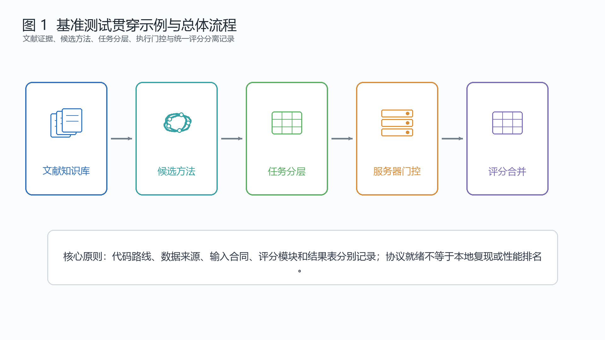
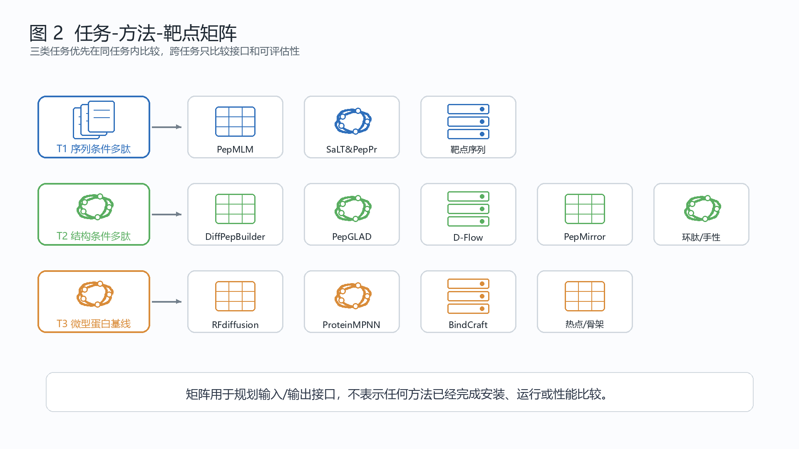
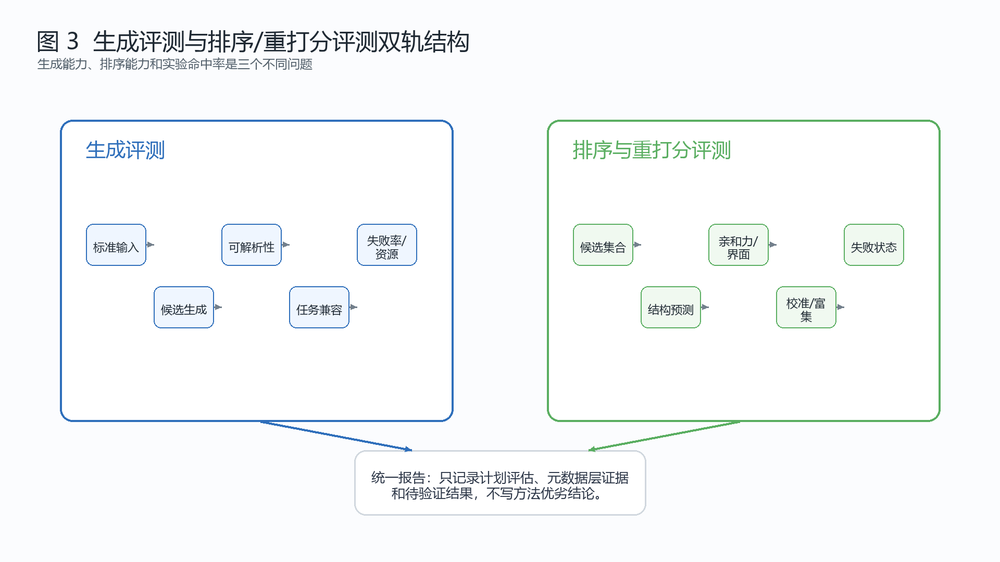
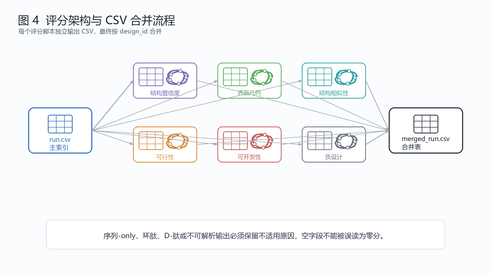

# 多肽设计基准测试文章初稿大纲（中文版 v1.0）

## 题名

**面向近期 AI 多肽设计方法的基准测试框架：任务分层、可运行性审计与统一评分协议**

## 文章定位

本文是一篇协议先行的基准测试（Benchmark）论文初稿大纲，核心目标是界定“如何公平、可复现、可审计地比较近期 AI 多肽设计方法”。本文不声称已经完成完整基准测试，不报告方法性能排名，也不声明任何候选方法已经在本地安装、运行或复现。

本文的证据基础来自本项目知识库的 2021-06-03 至 2026-06-03 文献范围、10 个第一轮纳入方法、2 个观察名单方法、v0.9 方法地形图、候选数据集就绪状态表、服务器端空跑合同、可运行性审计、主张-证据映射表，以及本地 Zotero 中与基准测试和评分相关的文献总结。

## 关键词

AI 多肽设计；基准测试；多肽结合剂（peptide binder）；环肽；D-肽；微型蛋白结合剂；可运行性审计；可开发性；排序与重打分

## 摘要

生成式模型、蛋白基础模型和结构设计方法正在进入多肽设计任务，覆盖线性多肽结合剂、环肽、D-肽、异手性多肽、微型蛋白结合剂以及蛋白-多肽相互作用等场景。然而，不同方法在输入、输出、依赖、代码、权重、手性约束和评分适用性方面差异较大。如果直接建立不分层的统一排行榜，容易混淆生成能力、排序能力、工程可运行性和生物学证据。

本文基于本地 Zotero/PD-wiki 知识库和外部元数据审计，提出一个面向近期 AI 多肽设计方法的协议先行基准测试框架。该框架包含三类任务接口、10 个第一轮纳入方法、2 个观察名单方法、候选数据集来源、靶点/对照集模式定义、生成评测与排序/重打分评测双轨协议、方法可运行性与服务器端空跑门控，以及 `run.csv -> metric CSVs -> merged_run.csv` 的统一评分数据流。

本文强调，AlphaFold 式排序、蛋白-多肽亲和力预测和多肽可开发性文献可用于设计评分与校准策略，但不能在未运行真实基准测试前支持方法优劣结论。当前版本的贡献是提供可复用的基准测试文章结构、证据边界、测试设计和后续执行待办事项，而不是给出最终性能排名或实验成功率。

## 1. 引言

### 1.1 研究背景与贯穿示例

多肽设计正在从经验筛选和结构启发式优化，扩展到由蛋白语言模型、扩散模型、全原子生成模型以及 AF2/MPNN 式流程支持的条件生成。PepMLM 代表靶点序列条件化的多肽结合剂设计方向；DiffPepBuilder、PepGLAD、D-Flow / PeptideDesign、PepMirror 和 AfCycDesign / ColabDesign cyclic peptide 代表结构条件化的多肽设计方向；RFdiffusion + ProteinMPNN 与 BindCraft 代表微型蛋白或蛋白结合剂基线流程。

图 1 应展示同一多肽结合靶点在三类路线中的输入输出差异：仅序列方法接收靶点序列并输出多肽序列；结构条件化方法需要靶点 PDB、口袋或参考结合肽并输出多肽结构或复合物；微型蛋白基线方法输出结合体骨架和序列。该示例的作用是说明任务接口差异，而不是展示方法优劣。

### 1.2 现有比较框架的缺口

当前多肽设计方法比较至少存在三类缺口。第一是任务错配：仅序列多肽、结构条件化多肽和微型蛋白结合剂的输出不能直接放入同一未分层榜单。第二是就绪状态错配：代码 URL、源码固定、服务器端合同或下载路线可能被误读为已安装、已复现或已可批处理。第三是证据层级错配：结构置信度、亲和力预测、可开发性代理指标、负设计/脱靶特异性和生物学验证属于不同证据层，不能折叠为单一总分。

### 1.3 研究问题

RQ1：如何在性能比较前，将近期 AI 多肽设计方法映射到任务兼容的基准测试接口？

RQ2：在生成输出或排序结果具备可解释性之前，需要记录哪些靶点、对照、泄漏风险、可运行性和评分元数据？

RQ3：哪些候选方法和候选数据集目前处于元数据、源码或空跑就绪门控，哪些证据仍需在服务器端补齐？

### 1.4 设计原则

本基准测试遵循五个原则。G1 任务兼容性：优先在同一任务内比较方法，再解释跨任务差异。G2 证据可追溯性：所有靶点、对照、检测类型、许可证和泄漏状态都必须有来源。G3 执行门控：方法状态应从 `metadata_ready`、`source_pinned`、`license_checked`、`weights_manifested`、`input_contract_ready`、`dry_run_ready` 到 `smoke_test_ready` 逐级推进。G4 指标适用性：不适用的结构或实验指标必须记录 `not_applicable_reason`。G5 主张安全性：协议就绪、服务器端计划、本地复现和生物学验证必须分层表述。

### 1.5 本文贡献

本文贡献包括：1）提出任务感知的基准测试协议，区分 T1/T2/T3 三类多肽设计任务；2）整理第一轮方法分类、代码路线和就绪门控；3）设计候选数据集来源表、靶点/对照集模式定义和不下载数据的审计边界；4）提出生成评测与排序/重打分评测双轨测试设计；5）建立中英文分稿、同步表、待办清单和主张门控，以支持后续正式论文写作。

## 2. 本地 Zotero 基准测试文献启示

本地基准测试与评分文献提示，生成、排序、可开发性和实验验证应拆分为独立证据层。`chang_ranking_2023` 支持将 AlphaFold 式竞争建模作为多肽结合剂排序设计的参考，但不能直接证明从头生成方法的性能。`romero-molina_ppi-affinity_2022` 和蛋白-多肽亲和力预测文献提示，多肽感知的评分不应直接套用小分子或通用蛋白-蛋白相互作用评分。`oeller_sequence-based_2023`、`pingitore_v_delocalized_2024` 和 `rettie_accurate_2025` 支持将可开发性作为独立评分族，但当前阶段只能记录元数据层代理指标。

## 3. 文献范围与候选方法筛选

文献时间窗固定为 2021-06-03 至 2026-06-03。当前知识库包含 432 条 Zotero 派生去重记录，其中 125 条为纳入文献。第一轮纳入方法为 PepMLM、SaLT&PepPr、DiffPepBuilder、PepGLAD、D-Flow / PeptideDesign、PepMirror、AfCycDesign / ColabDesign cyclic peptide、DexDesign / OSPREY3、RFdiffusion + ProteinMPNN 和 BindCraft。PepFlow 与 BoltzDesign1 保持观察名单状态。

纳入原则为：代码或服务有公开路线，输入输出可批处理，能映射到至少一个统一任务，并且有记录版本、参数和资源需求的可能性。排除或延后原则为：任务不贴合、权重不可得、批处理路线不清、输出不可评估，或依赖许可证未明确。

## 4. 候选方法分类与代码位置

表 1 应基于 `tables/candidate_method_classification_v1.csv` 展示候选方法分类。方法分为三层：

- `included`：10 个第一轮候选方法，进入当前协议和冒烟测试规划。
- 候选观察名单（`candidate_watchlist`）：PepFlow 与 BoltzDesign1，保留为后续替补或任务扩展候选。
- `review_only`：v0.9 方法地形图中的相关方法，仅用于相关工作、覆盖缺口分析和后续源码/许可证审计。

代码位置只记录外部代码仓库、Hugging Face、Zenodo 或待确认路线，不写成本地克隆路径。当前代码路线或源码固定不等于已安装、已复现或确认无问题。

## 5. 参考数据集来源与靶点集计划

表 2 应基于 `benchmarks/input_sets/reference_dataset_sources_v1.csv` 总结参考数据集来源。候选来源包括 Overath binder-success dataset、PEPBI、PepMerge/PepBDB/Q-BioLip、PepMirror resources、Chang AF2 ranking cases、PepBenchmark/PepBenchData、GPCR peptide design benchmark 和 TCRTransBench。

这些来源只支持候选靶点发现、排序校准、模式定义设计或相关工作梳理。`target_set_v0.csv` 仍为仅含模式定义的文件；任何候选数据集或靶点候选都不等于已冻结的基准测试靶点。所有数据源保持未下载或待核验状态。

## 6. 基准测试任务分层

T1 `sequence_binder`：靶点序列 -> 多肽序列。适配 PepMLM 和 SaLT&PepPr。

T2 `structure_peptide_binder`：靶点 PDB、口袋或参考结合肽 -> 多肽复合物或多肽结构。适配 DiffPepBuilder、PepGLAD、D-Flow / PeptideDesign、PepMirror、AfCycDesign / ColabDesign cyclic peptide 和 DexDesign / OSPREY3。

T3 `miniprotein_binder_baseline`：靶点 PDB、热点残基或长度约束 -> 结合体骨架与序列。适配 RFdiffusion + ProteinMPNN 和 BindCraft。

跨任务比较只报告工程可运行性、输出可评估性、资源需求和失败状态，不直接比较生物学成功率。

## 7. 生成评测协议

生成评测评价方法能否从标准化输入产生可解析、有效且任务兼容的输出。核心记录包括输出完整性、序列/PDB 可解析性、长度有效性、链标识有效性、手性标记、环化标记、非天然残基标记、失败状态、运行时间和资源元数据。

主索引为 `run.csv`。结构任务默认结合体链为 `A`，靶点链为 `B`；多链靶点用 `B,C,D...` 记录。任何方法特异的链命名约定都必须通过适配层保留从原始链到标准链的映射。

## 8. 排序与重打分评测协议

排序与重打分评测评价已有候选或生成候选能否被亲和力、结构、界面和可开发性证据合理排序。该轨道与生成评测分开报告，计划记录已知结合剂排序、负对照分离度、top-k 富集、校准误差和不适用原因。当前阶段只定义字段，不填入性能结果。

## 9. 统一评分框架

评分族包括：

- `structure_confidence`：pLDDT、pTM、ipTM、PAE/iPAE、ipSAE。
- `interface_geometry`：接触数、界面面积、氢键数、空间冲突数。
- `structure_similarity`：DockQ、骨架 RMSD、界面 RMSD。
- `design_feasibility`：长度、链标识有效性、手性标记、环化标记、输出可解析性。
- `developability`：净电荷、疏水性、芳香性、半胱氨酸/二硫键标记、聚集风险代理指标、合成复杂度标记。
- `negative_design` 与 `leakage_homology`：脱靶面板、序列/结构聚类、训练集泄漏风险。

对仅序列方法，结构指标需要等待下游结构预测，或标记为不适用。对 D-肽、环肽和含非天然氨基酸的多肽方法，必须显式记录手性、环化约束、残基表示方式和结构解析边界。

### 9.1 v1.1 补充资料驱动的评分边界

补充资料提示，蛋白-短肽对接或重打分不能只看对接评分。后续评分协议应记录结合区域是否正确、N/C 端方向是否合理、关键残基是否进入目标口袋或界面热点、构象是否存在明显不合理、不同多肽是否具备长度/电荷/结构来源/参数可比性，以及是否有分子动力学、自由能或实验验证状态。当前这些内容只作为计划中的解析器合同和写作边界，不报告任何真实对接或分子动力学结果。

环肽和非天然肽还需要拓扑感知评价记录。`cyclic=yes` 不足以描述头尾环化、侧链参与环化、二硫键、硫醚键、混合环化或多环化等差异；D/L/混合手性、N-甲基化、脂质化、糖基化、非天然氨基酸以及 HELM/CHUCKLES 表示也应进入未来元数据。新增 RFpeptides、CyclicMPNN、PPFlow、PepMimic、PocketXMol、BoltzGen、PepINVENT 和 HELM-GPT 仅作为补丁候选或仅综述线索，不改变当前 10 个纳入方法。

## 10. 可运行性、依赖与服务器门控

当前就绪门控包括 `metadata_ready`、`source_pinned`、`license_checked`、`weights_manifested`、`input_contract_ready`、`dry_run_ready` 和 `smoke_test_ready`。PepMLM 与 RFdiffusion + ProteinMPNN 已有 v0.7 服务器端合同和 v0.8 输入合同就绪线索；PepMirror 因 PyRosetta、Vina、OpenMM 和检查点路线仍保持依赖合同状态，不进入空跑就绪状态。

这些状态仅用于安排后续服务器端预检查，不代表本地复现。后续服务器执行必须在外部代码克隆、数据和权重根目录中完成，且不能把第三方源码、数据、权重或 GPU 结果纳入本知识库。

## 11. 数据泄漏、同源性与靶点新颖性

所有靶点和参考结合肽都必须记录训练集泄漏风险。蛋白靶点使用序列一致性或结构相似性聚类；多肽结合剂使用序列相似性和基序重叠评估。未核验前只允许写 `unknown`，不能写成独立测试。pMHC/TCR 样识别任务还需记录 HLA 等位基因、抗原肽、近邻肽面板和交叉反应风险。

## 12. 预期结果结构

当前结果部分只能包含计划性发现和就绪状态发现：

1. 文献和候选方法筛选结果。
2. 候选方法分类和代码路线。
3. 候选数据集来源与未下载状态。
4. T1/T2/T3 任务映射。
5. 生成评测与排序/重打分评测的评分设计。
6. 方法依赖、许可证、权重/检查点和服务器门控状态。
7. 后续真实基准测试的预留字段，例如可解析性、失败率、运行时间、top-k 富集和校准误差。

不能写入任何方法性能优劣、命中率、实验成功率或本地复现结论。

## 13. 讨论

本文的核心观点是，多肽设计基准测试应先解决任务定义、靶点/对照集、泄漏控制、工程可运行性和评分适用性，再讨论性能排序。计算评分只能支持候选排序和结构假设，不能替代实验亲和力、实验结构、细胞功能、PK/PD 或 CMC 证据。药物化学可开发性也不能被结合评分代替。

当前局限包括：靶点集尚未冻结，部分数据集的许可证、模式定义、对照和泄漏风险仍需核验，部分方法权重和依赖尚未解决，D-肽、环肽和含非天然氨基酸多肽的输出需要手性敏感的验证，真实冒烟测试和性能报告尚未开始。下一步应进入服务器端预检查包，而不是直接撰写性能结论。

## 14. 方法

文献检索与去重使用 Zotero item key、BibTeX key、DOI、PMID、arXiv ID 和规范化题名。候选方法筛选使用 `candidate_method_scorecard.csv` 与 `method_landscape_watchlist_v0.9.csv`。数据集来源使用 `candidate_benchmark_datasets.csv`、`dataset_supplement_schema_review_v0.8.csv` 和 v1.0 参考数据集表。测试协议使用 `run_csv_schema.md`、`benchmark_protocol_v0.md` 和 `scoring_outputs_schema.md`。项目完整性由 `scripts/validate_benchmark_kb.py` 检查。

## 15. 图表草稿与嵌入表格

本节把原“图表计划”升级为可阅读的图表草稿。四张图为概念示意图，用于解释论文结构和测试协议，不代表真实 benchmark 结果。四张表均从项目 CSV 提取；完整字段和未截断内容以原 CSV 为准。

### 图 1. 基准测试贯穿示例与总体流程

图 1 展示从文献知识库、候选方法、任务分层、服务器端执行门控到统一评分合并表的整体流程。该图只说明协议结构，不表示任何方法已经完成本地复现。

### 图 2. 任务-方法-靶点矩阵

图 2 强调 T1、T2、T3 三类任务的输入/输出和可比对象不同。后续比较应优先在同一任务内进行，跨任务只比较接口、可运行性和可评估性。

### 图 3. 生成评测与排序/重打分评测双轨结构

图 3 将生成能力与排序/重打分能力拆开记录。生成评测关注输出是否可解析、是否满足任务约束和失败率；排序/重打分评测关注已有候选集合的结构、亲和力代理指标、校准和富集趋势。

### 图 4. 评分架构与 CSV 合并流程

图 4 对应 `run.csv -> metric CSVs -> merged_run.csv` 的数据流。结构置信度、界面几何、结构相似性、设计可行性、可开发性和负设计相关指标应由独立 CSV 输出，再按 `design_id` 合并。

### 表 1. 候选方法分类、任务、输入输出和当前门控

来源：`tables/candidate_method_classification_v1.csv`。

| 方法 | 状态 | 任务 | 设计范式 | 多肽类型 | 输入 | 输出 | 代码路线 | 当前门控 |
| --- | --- | --- | --- | --- | --- | --- | --- | --- |
| PepMLM | 纳入 | T1 序列结合肽 | 序列驱动 | 线性肽 | 靶点序列或仅序列 CSV | 多肽序列 | [GitHub](https://github.com/programmablebio/pepmlm) | 输入合同就绪（input_contract_ready） |
| SaLT&PepPr | 纳入 | T1 序列结合肽 | 序列驱动 | 线性肽/降解剂接口 | 靶点序列与降解剂/界面上下文 | 多肽序列 | [GitHub](https://github.com/programmablebio/saltnpeppr) | 源码固定未安装（source_pinned） |
| DiffPepBuilder | 纳入 | T2 结构条件多肽 | 结构驱动 | 线性或二硫环化肽 | 靶点 PDB 与口袋定义 | 多肽复合物或多肽结构 | [GitHub](https://github.com/YuzheWangPKU/DiffPepBuilder) | 源码固定未安装（source_pinned） |
| PepGLAD | 纳入 | T2 结构条件多肽 | 结构驱动 | 线性全原子肽 | 靶点 PDB 与口袋定义 | 全原子多肽结构 | [GitHub](https://github.com/THUNLP-MT/PepGLAD) | 源码固定未安装（source_pinned） |
| D-Flow / PeptideDesign | 纳入 | T2 结构条件多肽 | 结构驱动 | D-肽 | 靶点或镜像靶点结构 | D-肽结构 | [GitHub](https://github.com/smiles724/PeptideDesign) | 源码固定未安装（source_pinned） |
| PepMirror | 纳入 | T2 结构条件多肽 | 结构驱动 | D-肽 | 靶点 PDB 与手性感知上下文 | 异手性多肽复合物或排序候选 | [GitHub](https://github.com/YZY010418/PepMirror) | 源码固定未安装（source_pinned） |
| AfCycDesign / ColabDesign cyclic peptide | 纳入 | T2 结构条件多肽 | 结构驱动 | 环肽 | 靶点 PDB 或环肽约束 | 环肽序列或结构 | [GitHub](https://github.com/sokrypton/ColabDesign) | 源码固定未安装（source_pinned） |
| DexDesign / OSPREY3 | 纳入 | T2 结构条件多肽 | 结构驱动 | D-肽 | 靶点 PDB 与设计搜索规范 | D-肽抑制剂序列/结构 | [GitHub](https://github.com/donaldlab/OSPREY3) | 源码固定未安装（source_pinned） |
| RFdiffusion + ProteinMPNN | 纳入 | T3 微型蛋白基线 | 结构驱动 | 微型蛋白 | 靶点 PDB、热点/contig 与固定链交接 | 结合体骨架与序列 | 多仓库路线 | 输入合同就绪（input_contract_ready） |
| BindCraft | 纳入 | T3 微型蛋白基线 | 结构驱动 | 微型蛋白 | 靶点 PDB | 结合体骨架与序列 | [GitHub](https://github.com/martinpacesa/BindCraft) | 源码固定未安装（source_pinned） |
| PepFlow | 候选观察 | T2 结构条件多肽 | 结构驱动 | 线性全原子肽 | 靶点 PDB 或多肽上下文 | 多肽结构 | pending_github_or_huggingface_route | 元数据就绪（metadata_ready） |
| BoltzDesign1 | 候选观察 | T3 微型蛋白基线 | 结构驱动 | 微型蛋白或多肽 | 靶点结构 | 结合剂候选 | pending_public_workflow_route | 元数据就绪（metadata_ready） |

### 表 2. 参考数据集来源、用途和可用性状态

来源：`benchmarks/input_sets/reference_dataset_sources_v1.csv`。

| 数据集 | 来源名称 | 任务适配 | 许可证 | 模式定义状态 | 下载状态 | 计划用途 |
| --- | --- | --- | --- | --- | --- | --- |
| overath_binder_success_2025 | Predicting Experimental Success in De Novo … | T3 微型蛋白基线；评分校准 | CC BY 4.0 数据集记录 | 已有 final_dataset.csv 模式线索 | 未下载 | 排序/重打分与评分校准候选 |
| pepbi_dryad_2025 | Predicted and Experimental Peptide Binding … | T2 结构条件多肽；排序/重打分 | CC0 1.0 | 下载路线待确认，模式未扫描 | 未下载，下载路线待核验 | 蛋白-多肽结合/排序数据候选 |
| pepmerge_pepbdb_qbiolip | PepMerge / PepBDB / Q-BioLip peptide-recept… | T2 结构条件多肽；泄漏参照 | 仓库数据许可待核验 | 有元数据，数据路线未确认 | 未下载 | 泄漏筛查与结构语料参照 |
| pepmirror_pepbench_protfrag | PepMirror LNR / PepBench / ProtFrag resourc… | T2 结构条件多肽；D-肽/手性感知 | 仓库 MIT/检查点与数据许可待核验 | 有元数据，数据路线未确认 | 未下载 | D-肽/手性感知模式与来源参照 |
| chang_af2_ranking_cases_2023 | Ranking Peptide Binders by Affinity with Al… | T1 序列结合肽；T2 结构条件多肽；排序/重打分 | 论文许可待核验 | 需从论文/补充材料提取案例 | 未下载 | 小型排序/重打分校准案例 |
| pepbenchmark_2026 | PepBenchmark / PepBenchData | T1 序列结合肽；可开发性；性质评测 | HF 卡片未声明许可 | 已从 HF 文件列表部分映射 | 未下载 | 序列/性质评测与可开发性候选 |
| gpcr_peptide_benchmark_2026 | Assessment of Generative De Novo Peptide De… | T2 结构条件多肽；T3 微型蛋白基线 | 预印本许可待核验 | 仅元数据，未提取表格 | 未下载 | GPCR 靶点类别与评测设计参照 |
| tcrtransbench_2026 | TCRTransBench: Bidirectional TCR-Peptide Se… | T1 序列结合肽；pMHC/TCR-like 识别 | arXiv 许可待核验 | 元数据提示配对任务，数据路线未确认 | 未下载 | pMHC/TCR-like 任务与交叉反应模式参照 |

### 表 3. 测试设计与指标适用性

来源：`tables/scoring_metric_rationale_matrix_v1.1.csv`。

| 检查/指标 | 指标族 | 设计理由 | 适用任务 | 不适用原因 | 主张边界 |
| --- | --- | --- | --- | --- | --- |
| 结合区域正确性 (`binding_region_correctness`) | 界面几何 | 短肽可能在无关蛋白表面获得较好分数，需确认结合区域是否有意义 | T2 结构条件多肽；T3 微型蛋白基线 | 仅序列输出或无参考结合区域 | 区域匹配只是构象合理性证据，不是亲和力证明 |
| N/C 端方向状态 (`terminal_orientation_status`) | 设计可行性 | 多肽具有 N 到 C 方向，方向反转会破坏基序或热点解释 | T2 结构条件多肽 | 未定义方向性基序 | 只有存在基序上下文时，方向才支持机制解释 |
| 关键残基匹配状态 (`key_residue_match_status`) | 界面几何 | 关键残基需对准目标口袋或热点，不能只看相互作用数量 | T2 结构条件多肽；排序/重打分 | 无已知关键残基 | 氢键数量不能单独写成强机制证据 |
| 构象合理性 (`conformational_plausibility`) | 设计可行性 | 柔性多肽可能产生张力大或未锚定的虚假高分构象 | T2 结构条件多肽；cyclic_peptide_tasks | 仅序列输出 | 构象合理性仍是计划中的解析/人工质控证据 |
| 评分可比性分组 (`score_comparability_group`) | 排序/重打分 | 长度、电荷、结构来源和参数会影响不同多肽分数可比性 | T1 序列结合肽；T2 结构条件多肽；排序/重打分 | 无共同评分协议 | 跨长度或跨电荷排序应解释为未校准比较 |
| 环化模式 (`cyclization_mode`) | 设计可行性 | 环肽需区分头尾、侧链、二硫键、硫醚键和混合环化等模式 | T2 结构条件多肽 | 线性肽输出 | `cyclic=yes` 不足以支持拓扑感知评价 |
| 手性细节 (`chirality_detail`) | 设计可行性 | D-肽和异手性输出需要立体化学感知解析与评分适用性标记 | T2 结构条件多肽 | 仅 L-肽输出 | D/L 标记不证明评分函数适用于 D-肽 |
| 非天然残基表示 (`non_natural_residue_representation`) | 可开发性 | 非天然残基、N-甲基化和骨架修饰需显式表示，如 HELM/CHUCKLES | T1 序列结合肽；T2 结构条件多肽 | 仅天然氨基酸输出 | 表示能力是解析器证据，不是临床可开发性证据 |
| 元数据层可开发性 (`metadata_level_developability`) | 可开发性 | 结合评分不能覆盖电荷、疏水性、聚集风险、通透性和合成复杂度 | all_tasks | 输出不可解析 | 元数据代理指标不能写成实测溶解度或稳定性 |
| 流匹配范式标签 (`flow_matching_paradigm_label`) | 方法地形图 | 流匹配只是生成范式标签，不能替代源码、许可或冒烟测试证据 | method_landscape_only | 不是评分指标 | 范式标签不能替代源码固定、许可或冒烟测试证据 |

### 表 4. 方法就绪门控与执行边界

来源：`benchmarks/deployment/method_readiness_review_v0.8.csv`。

| 方法 | 组件 | 当前门控 | 许可证状态 | 输入合同 | 权重/检查点 | 决策 |
| --- | --- | --- | --- | --- | --- | --- |
| PepMLM | repo_plus_huggingface_model | 输入合同就绪（input_contract_ready） | 仓库许可未在本地克隆中确认；HF 模型卡含 MIT 和额外使用约束字段 | 仅序列 CSV 占位输入合同就绪 | HF 快照 SHA 已记录，未下载 | 模型许可和输入合同可审计，但未达到运行就绪 |
| RFdiffusion | source_and_checkpoints | 输入合同就绪（input_contract_ready） | 本地许可文件为 BSD；README 提示代码和权重覆盖 | PDB 占位合同就绪，但 contig/热点缺失 | README 检查点 URL 已记录，大小和校验和待补 | 许可已查、输入合同可审计，但未达空跑就绪 |
| ProteinMPNN | source_weights_and_second_stage_handoff | 作为 RFdiffusion 第二阶段输入合同就绪 | 本地许可文件为 MIT | 已映射 ProteinMPNN 的 PDB 路径和输出目录参数 | 外部固定克隆中有权重目录，KB 未下载 | 许可已查，阶段交接合同待补 |
| PepMirror | repo_checkpoint_and_dependency_stack | 源码固定未安装（source_pinned） | 仓库 MIT；Zenodo 检查点 CC BY 4.0；PyRosetta 需许可 | 依赖栈和 D-肽解析器解决前不创建真实 run.csv | Zenodo 8 个检查点文件、大小和 MD5 已列入清单 | 检查点可审计，但依赖受阻，保持源码固定状态 |

## 16. 待办清单

待办事项详见 `reports/benchmark_manuscript_todo_v1.csv`。优先级最高的任务为：补充图 1 的贯穿示例，完成人工复核表 1 和表 2，使用 citation-management 校验 citation key，并在服务器端执行前关闭 PepMLM、RFdiffusion + ProteinMPNN 和 PepMirror 的许可证、检查点和输入合同开放项。

## 17. 参考文献与引用边界

引用清单详见 `reports/benchmark_reference_bibliography_v1.md`。正文引用优先使用现有 BibTeX key；外部来源如 Overath、PepBenchmark、TCRTransBench 和 GPCR benchmark 在未进入 `references.bib` 前必须标注 `needs_bibtex_verification`。不得新增无法追溯的引用。
